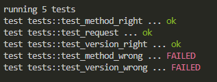

# 
**LAB Assignment 7**

## 1.ให้ Design httpRequest พร้อมเขียน code และรันแสดงผลลัพธ์

- **Note:** 1.ทดสอบ Version ที่รับเข้ามา
            2.ทดสอบ Version ที่รับเข้ามาผิด
            3.ทดสอบว่าสามารถแปลง String เป็น Method ได้หรือไม่ 
            4.ทดสอบการสร้าง object ของ Request

## 2.ให้ Design httpResponse พร้อมเขียน code และรันแสดงผลลัพธ์
- **Note:** ตรวจสอบการสร้างออบเจ็กต์ของ HttpResponse ว่าสามารถสร้างขึ้นมาได้อย่างถูกต้องหรือไม่
***
<marquee>6303051613033 วิวรรธน์ จงสมจิตต์ EnET-C KMUTNB</marquee>
